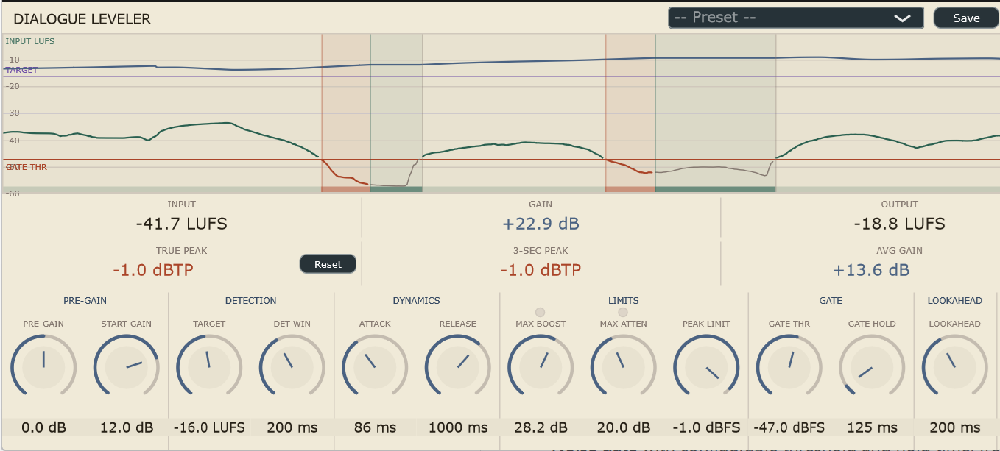

# Dialogue Leveler — VST3 Automatic Dialogue Leveler

A vocal-rider style loudness leveler for speech and dialogue post-production, built with JUCE. Targets Adobe Premiere Pro on Windows (VST3).



---

## Download

Pre-built Windows installer available on the [Releases](../../releases/latest) page — no build tools required.

---

## Features

- **K-weighted loudness detection** (ITU-R BS.1770-4) with a user-configurable sliding window
- **Asymmetric attack/release** — gain drops fast when dialogue gets loud, rises slowly when it goes quiet
- **Noise gate** with configurable threshold and hold time, freezing gain during silences so room tone isn't pumped up
- **Lookahead delay line** — delays the audio path so gain correction arrives before loud transients; reports latency to the host for Plugin Delay Compensation (PDC)
- **Peak limiter** — parallel instantaneous peak envelope detector that overrides the LUFS leveler when transients exceed a threshold, with block-level pre-scan for intra-block lookahead
- **True Peak metering** via 4× FIR oversampling (ITU-R BS.1770-4 compliant dBTP)
- **3-second rolling True Peak** display alongside an all-time peak hold
- **Average gain display** using a Welford online mean — memory-safe for indefinite sessions
- **Starting Gain** — set the leveler's initial gain at playback start to eliminate ramp-up from unity
- **Pre-Gain** and **Output Trim** for input/output level adjustment
- **Scrolling gain graph** showing gain-over-time history
- **Clip LEDs** for Max Boost and Max Attenuation limits
- **Preset system** — save and load named presets as XML files

---

## Parameters

| Parameter | Range | Default | Description |
|---|---|---|---|
| Pre-Gain | −24 to +24 dB | 0 dB | Fixed gain applied before the leveler sees the signal |
| Start Gain | −24 to +24 dB | 0 dB | Gain the leveler starts from at playback start (no ramp-up) |
| Target Level | −30 to 0 LUFS | −16 LUFS | Target loudness the leveler rides toward |
| Detection Window | 50–1000 ms | 400 ms | Length of the loudness averaging window |
| Attack | 1–1000 ms | 50 ms | How fast gain drops when the signal gets louder than target |
| Release | 10–3000 ms | 400 ms | How fast gain rises when the signal drops below target |
| Max Boost | 0–48 dB | 12 dB | Maximum gain the leveler will add |
| Max Attenuation | 0–48 dB | 8 dB | Maximum gain the leveler will subtract |
| Peak Limit | −24 to 0 dBFS | −1 dBFS | Peak limiter threshold; fast (1ms) limiter kicks in above this |
| Gate Threshold | −80 to −20 dBFS | −55 dBFS | Signals below this are treated as silence; gain freezes |
| Gate Hold | 0–2000 ms | 300 ms | How long after signal drops below gate before gain freezes |
| Lookahead | 0–500 ms | 0 ms | Audio delay for pre-emptive gain reduction; adds PDC latency |
| Output Trim | −24 to +24 dB | 0 dB | Final output trim applied after all leveling |

---

## Prerequisites

| Tool | Minimum version | Notes |
|---|---|---|
| CMake | **3.22** | The version bundled with Visual Studio may be older — install from cmake.org |
| Visual Studio | 2019 or 2022 | Desktop C++ workload required |
| Git | any recent | Required by CMake FetchContent to clone JUCE |

No manual JUCE download needed — FetchContent pulls JUCE 8.0.14 automatically on first configure.

---

## Build

Open a **Developer Command Prompt** (or any terminal with `cmake` on PATH):

```bat
git clone https://github.com/sahko123/dialogue-leveler.git
cd dialogue-leveler

:: Configure — pick the generator matching your Visual Studio version
cmake -B build -G "Visual Studio 17 2022" -A x64   :: VS 2022
cmake -B build -G "Visual Studio 16 2019" -A x64   :: VS 2019

:: Build (Release)
cmake --build build --config Release
```

First configure downloads JUCE (~450 MB) and may take several minutes. Subsequent builds are fast.

### Outputs

| Target | Path |
|---|---|
| VST3 bundle | `build\DialogueLeveler_artefacts\Release\VST3\DialogueLeveler.vst3` |
| Standalone app | `build\DialogueLeveler_artefacts\Release\Standalone\DialogueLeveler.exe` |

---

## Install into Premiere Pro

Copy the `.vst3` bundle to the system VST3 folder (**requires Administrator**):

```bat
xcopy /E /I /Y "build\DialogueLeveler_artefacts\Release\VST3\DialogueLeveler.vst3" ^
      "C:\Program Files\Common Files\VST3\DialogueLeveler.vst3"
```

Then in Premiere Pro: **Edit → Preferences → Audio → Audio Plug-In Manager → Scan for Plug-ins**.

---

## Lookahead and Plugin Delay Compensation

When **Lookahead** is set above 0 ms the plugin delays its audio output by that amount and reports the latency to the host via `setLatencySamples()`. Premiere Pro compensates automatically, keeping all tracks in sync.

**Important:** the lookahead value is locked at `prepareToPlay` time. Changes to the knob only take effect after stopping and restarting playback.

At the maximum setting (500 ms), PDC adds 500 ms of latency to all compensated tracks — fine for offline export but noticeable during real-time preview. For real-time monitoring keep Lookahead at 0 ms.

---

## Presets

Presets are stored as XML files in:

```
%APPDATA%\DialogueLeveler\Presets\
```

Use the **Save** / **Delete** buttons and the preset dropdown in the plugin window.

---

## Suggested starting settings

### Dialogue leveling (streaming / YouTube)

| Parameter | Value |
|---|---|
| Target Level | −16 LUFS |
| Detection Window | 200–400 ms |
| Attack | 30–50 ms |
| Release | 300–500 ms |
| Max Boost | 12 dB |
| Max Attenuation | 8 dB |
| Peak Limit | −3 dBFS |
| Gate Threshold | −55 dBFS |
| Gate Hold | 300 ms |
| Lookahead | 20 ms (restart playback after setting) |

### Broadcast (EBU R128)

| Parameter | Value |
|---|---|
| Target Level | −23 LUFS |
| Max Boost | 9 dB |
| Max Attenuation | 6 dB |
| Peak Limit | −1 dBFS |

---

## JUCE licensing

Built with [JUCE](https://juce.com). JUCE is free for personal/non-commercial use under the **JUCE Personal** tier (GPLv3). Commercial distribution requires a JUCE license or releasing the full source under GPLv3.
